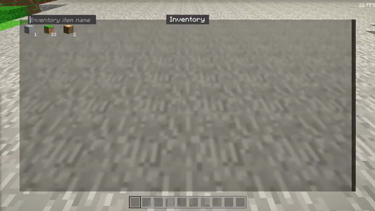
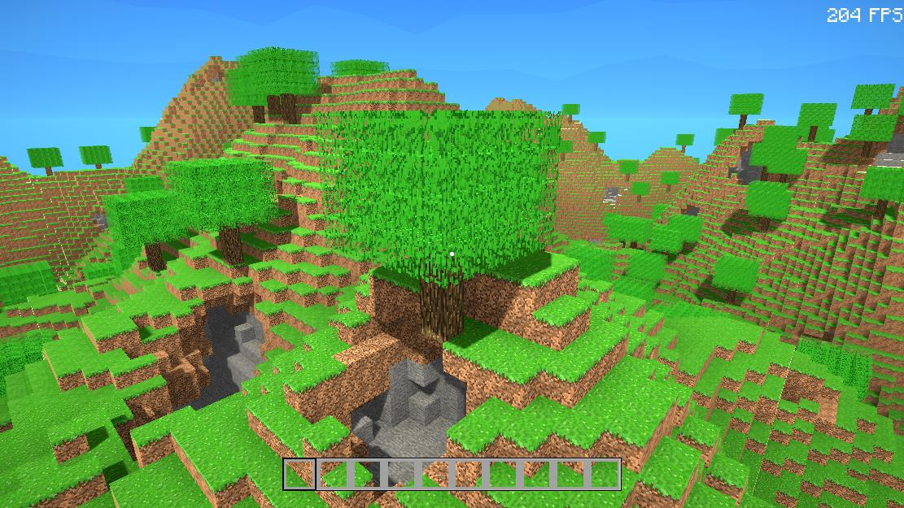
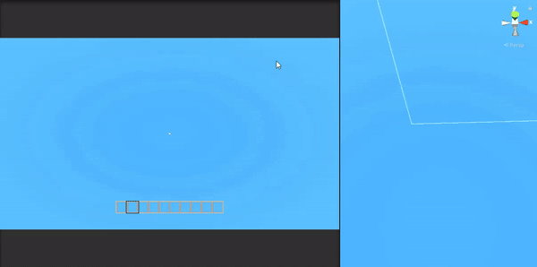

# Minecraft
A minecraft clone using Unity3D

# Update 4 (08 Mar 2021)
## Inventory Update
 
- Searchable inventory (basically query)
    - Potentially extandable with query flags



 - Drag and droppable inventory items. Quickbar and inventory itself is targetable. To remove (drop) an item from the inventory, just drag and drop the item outside of the inventory or quickbar


# Update 3 (28 Oct 2020)

- ## Command prompt. 
<i>`Standard keybinding: F1`</i>


Features:

 - Logs
 - Auto-Complete <i>`Standard keybinding: Tab`</i>
 - Suggestions, when entering text
 - Implement your own function, by using the attribute `[ConsoleMethod]`
```cs
[ConsoleMethod(nameof(MovePlayer), "Teleports the player to the given x, y, z location")]
private void MovePlayer(int x, int y, int z)
{
    UpdateLatestPlayerPosition();
    transform.position = new Vector3(x, y, z);
    OnDirectionModified?.Invoke(Direction.Teleported);
}
```
 - Descriptions
 - showing parameters


- ## Persistance

 - Chunks


 - World settings

```json
{
    "WorldName": "_debug_world_",
    "NoiseSettings": {
        "Smoothness": 2.5,
        "Seed": 123
    }
}
```
- Inventory

```json
"items": [
    {
        "QuickbarIndex": -1,
        "ItemID": 6,
        "Amount": 1
    },
    {
        "QuickbarIndex": 1,
        "ItemID": 1,
        "Amount": 1
    }]
```

 - ## Menu


# Update 2 (4 Jul 2020)

Current state includes __Cross Chunk Structures__ like trees:

Dynamic map allocation:|Trees:
-----------------------|-------------------------------
         |

# Update 1 (14 Dec 2019):
---
Basic terrain generation with bioms:

